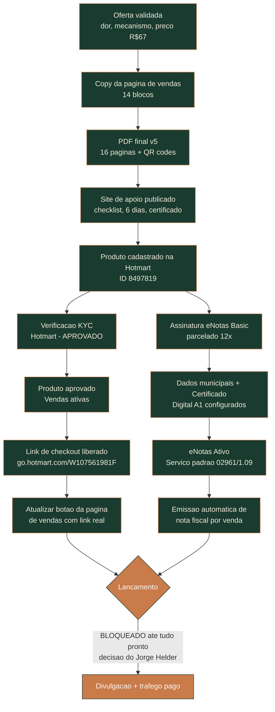

# Mapa do Hoje — Fluxo e Pendências

> Produto ativo na esteira de negócios da Hotmart. Documento vivo — atualizar a cada
> etapa concluída ou pendência nova, igual ao protocolo de tracker do cockpit.

**Última atualização:** 12/09/2026 (link da bio corrigido pro site de apoio, rodapé com CNPJ)

## Fluxograma

## Checklist de ações e pendências

### Concluído

- [x] Oferta estruturada (dor, mecanismo único, preço R$67, revisão de pontos com o squad)
- [x] Copy da página de vendas (14 blocos)
- [x] PDF final (16 páginas, foto da Força corrigida, QR codes com check-in, frase de sequência de produtos) — v5
- [x] Site de apoio publicado em `docs/mapa-do-hoje/` (checklist interativo, 6 páginas de dia, certificado de conquista)
- [x] Produto cadastrado na Hotmart (ID 8497819) — nome, descrição, categoria, capa, preço R$67 à vista
- [x] Assinatura eNotas Basic contratada (720 notas/ano, parcelado 12x de R$126,90)
- [x] **Aprovação do KYC pela Hotmart** — confirmado em 11/09/2026 direto no painel: produto com selo "Vendas ativas", mensagem "Tudo pronto para suas vendas!"
- [x] **Link de checkout liberado** — página de vendas: `https://go.hotmart.com/W107561981F`
- [x] Botão da página de vendas (`docs/mapa-do-hoje/index.html`) atualizado com o link real de checkout, nos dois CTAs
- [x] **eNotas configurado e ativo** (11/09/2026, direto em `app.enotas.com.br`):
  - Dados municipais: Inscrição Municipal 7.545.710-5, Porte ME, não optante do Simples Nacional, emissão pela própria prefeitura de SP (Nota Fiscal Paulistana — já credenciados, emitindo há meses pra outro cliente), sem Inscrição Estadual (atividades da OLA são só serviço, não têm circulação de mercadoria)
  - Certificado Digital A1 (e-CNPJ) importado e validado, vencimento 15/07/2027
  - Serviço padrão: código `02961 | 1.09` (Disponibilização, sem cessão definitiva, de conteúdos de imagem e texto pela internet), ISS 2,90% — escolhido com apoio do Squad Low Ticket Arcane (Vol. 1: o Mapa do Hoje é "produto ferramental" — PDF + checklist de consumo rápido — não consultoria/assessoria continuada)
  - Plano contratado: eNotas Emissor Básico (Anual) — Ativo
  - **Confirmado direto na prefeitura (11/09/2026):** testado no site oficial (nfe.prefeitura.sp.gov.br, emissão de NFS-e) — o código `02961` preencheu automaticamente o nome "Disponibilização de conteúdos de imagem e texto p/ internet". Está ativo e válido, não foi descontinuado (a dúvida vinda de fonte externa não se confirmou).
- [x] **Canal de venda Hotmart conectado ao eNotas** (11/09/2026, em Gerenciar → Apps → Hotmart, via e-mail + Hottok/token de webhook): garantia de 7 dias, notas fiscais emitidas automaticamente **após a garantia** (não na venda), enviadas por e-mail ao cliente, e canceladas automaticamente se a venda for cancelada/reembolsada. Essa conexão é separada de configurar a empresa no eNotas — sem ela as vendas não disparavam nenhuma nota.
- [x] **Código de Serviço corrigido** (12/09/2026): o código original `02961 | 1.09` nunca esteve habilitado no cadastro da OLA na prefeitura (empresa aberta pra outras atividades — turismo/esportes/eventos/saúde). Trocado para `05762 | 8.02` (instrução/treinamento), ISS 5% (era 2,90%). Nota de teste (HP3708447756) **emitida com sucesso** — correção validada ponta a ponta. Detalhes em `HOTMART/Passo a Passo - Configuracao eNotas.md`.
- [x] **Momento de emissão revertido pra "Após a garantia"** (12/09/2026) — estava temporariamente em "Na venda" só pro teste, voltado pra config definitiva (7 dias) antes de novas vendas reais.
- [x] **Lançamento desbloqueado** (12/09/2026) — decisão explícita do Jorge Helder de apresentar o produto ao público, mesmo com a logo e a captura de lead ainda pendentes (não são bloqueantes).
- [x] **Artes dos 3 pinned posts produzidas** (12/09/2026, Squad Carrossel Arcane) — 18 slides (Sobre 5, Tese 5, Oferta 8) em `Downloads/pinned-0{1,2,3}-.../slide-NN.png`. Aguardando revisão e "publica" explícito antes de subir no Instagram. Detalhes em `REELS TURBINAR/A Maldição do Depois/pinned-posts-squad-posicionamento.md`.
- [x] **Link da bio corrigido pra apontar pro funil principal** (12/09/2026, Squad Posicionamento + Squad Low Ticket Arcane) — bio apontava pra `olaexperience.tv` (institucional, sem produto/checkout). Trocado pra `olaexperience.tv/mapa-do-hoje/` (site de apoio já no padrão Maxxima: FAQ com garantia e "checkout seguro Hotmart", CTA direto pro checkout real `go.hotmart.com/W107561981F`). Rodapé completado com CNPJ (Bloco 14 do método, sinal de legitimidade pra reduzir insegurança de marca nova) — falta só e-mail em domínio próprio (ver pendência abaixo).
- [x] **3 pinned posts publicados** (12/09/2026, aprovados pelo Jorge Helder) — Sobre, Tese e Oferta subiram no Instagram, nessa ordem, com legenda e hashtags de descoberta. Rótulo de IA conferido desligado nos 3.

### Pendente

- [ ] **Criar e-mail em domínio próprio (@olaexperience.tv)** — rodapé do site de apoio já cita "e-mail próprio do domínio (não Gmail)" como sinal de confiança (Bloco 14, método Maxxima), mas o serviço de e-mail ainda não existe pro domínio. Precisa contratar hospedagem de e-mail (Google Workspace, Zoho Mail, etc.) — decisão/pagamento do Jorge Helder.
- [ ] **Fixar os 3 posts no grid** (Sobre → Tese → Oferta) — já publicados (12/09/2026), mas "Fixar no perfil" não existe no menu "..." da versão web do Instagram, só no app do celular. Precisa o Jorge Helder abrir cada post no app e fixar, nessa ordem (a última fixada fica primeiro, então fixar Oferta → Tese → Sobre, nessa ordem, pra Sobre ficar em primeiro).
- [ ] **Validar com o contador (Renato Lacerda)** se o código 05762 (ISS 5%) é o definitivo, ou se compensa incluir um código específico de conteúdo digital no cadastro pra baixar a alíquota de volta perto de 2,90% — rascunho de e-mail pronto em `HOTMART/Rascunho E-mail - Renato Lacerda (Codigo de Servico).md`.
- [ ] **Subir a logo (imagem de perfil) no Perfil Público da Hotmart** — `account.hotmart.com/public-profile`. Tentativa nº3 (12/09/2026) com versão quadrada `docs/assets/logo-quadrada-perfil.png` também não persistiu via automação — fazer manualmente com esse arquivo. Ver `perfil-para-compradores-hotmart.md`.
- [ ] Avaliar lacuna de captura de contato de quem compra (sem e-mail/lead capturado hoje — ver `agents/companion/data/demandas-backlog.md`)
- [ ] **Criar o cupom de teste MAPA47 (R$67→R$47)**, se o Jorge Helder quiser testar preço menor. Parâmetros já calculados, ver `precificacao-teste-47.md`.

## Referências

- Documentação completa de decisões: [[produto]]
- Copy da página de vendas: [[pagina-vendas]]
- Backlog geral (ideias/lacunas): `agents/companion/data/demandas-backlog.md`
- Log de decisões estratégicas: `agents/companion/data/log-decisoes.md`
- Rascunho de e-mail pro contador sobre o eNotas: `HOTMART/Rascunho eNotas - Contador.docx`
- **Pinned posts prontos, arquivados até liberar:** `REELS TURBINAR/A Maldição do Depois/pinned-posts-squad-posicionamento.md` — o Pinned 3 (Oferta) só publica quando este produto estiver liberado.
- **Estratégia de preço, dois caminhos prontos:** `precificacao-teste-47.md` — manter R$67 de tabela ou testar R$47 via cupom, com thresholds de tráfego já calculados.
