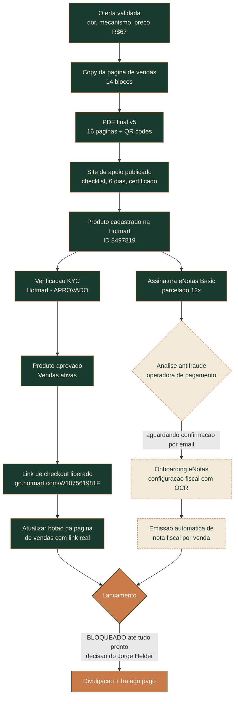

# Mapa do Hoje — Fluxo e Pendências

> Produto ativo na esteira de negócios da Hotmart. Documento vivo — atualizar a cada
> etapa concluída ou pendência nova, igual ao protocolo de tracker do cockpit.

**Última atualização:** 11/09/2026 (botão da página de vendas atualizado com o link real de checkout)

## Fluxograma

## Checklist de ações e pendências

### Concluído

- [x] Oferta estruturada (dor, mecanismo único, preço R$67, revisão de pontos com o squad)
- [x] Copy da página de vendas (14 blocos)
- [x] PDF final (16 páginas, foto da Força corrigida, QR codes com check-in, frase de sequência de produtos) — v5
- [x] Site de apoio publicado em `docs/mapa-do-hoje/` (checklist interativo, 6 páginas de dia, certificado de conquista)
- [x] Produto cadastrado na Hotmart (ID 8497819) — nome, descrição, categoria, capa, preço R$67 à vista
- [x] Assinatura eNotas Basic contratada (720 notas/ano, parcelado 12x de R$126,90)
- [x] **Aprovação do KYC pela Hotmart** — confirmado em 11/09/2026 direto no painel: produto com selo "Vendas ativas", mensagem "Tudo pronto para suas vendas!"
- [x] **Link de checkout liberado** — página de vendas: `https://go.hotmart.com/W107561981F`
- [x] Botão da página de vendas (`docs/mapa-do-hoje/index.html`) atualizado com o link real de checkout, nos dois CTAs

### Pendente

- [ ] **Automação do eNotas com a Hotmart** — pagamento em análise antifraude pela operadora; depois disso vem o e-mail de onboarding/configuração fiscal (OCR de documentos). Não encontrado nada sobre isso dentro do painel Hotmart (é integração externa, no eNotas) — checar e-mail.
- [ ] Avaliar lacuna de captura de contato de quem compra (sem e-mail/lead capturado hoje — ver `agents/companion/data/demandas-backlog.md`)
- [ ] **Lançamento oficial** (divulgação, tráfego pago) — bloqueado por decisão explícita do Jorge Helder até todos os itens acima estarem prontos

## Referências

- Documentação completa de decisões: [[produto]]
- Copy da página de vendas: [[pagina-vendas]]
- Backlog geral (ideias/lacunas): `agents/companion/data/demandas-backlog.md`
- Log de decisões estratégicas: `agents/companion/data/log-decisoes.md`
